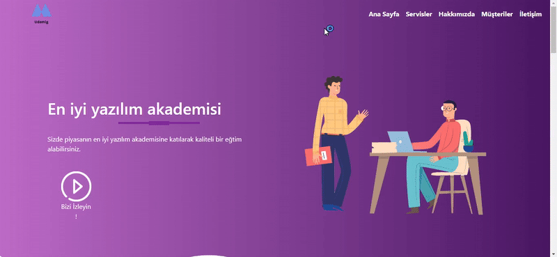

# 🎓 Udemig Education - A Premium Learning Platform

This project is a responsive website template designed for **Udemig Education**, a platform offering top-notch tech and software education. Built with **HTML**, **CSS**, and **Bootstrap**, the website showcases courses, services, and features that set Udemig apart as a leader in the field of education.

## ⚙️ Features
✅ **Responsive Layout** – Seamless experience across all devices, from desktop to mobile.  
✅ **Modern Navbar** – A fixed navigation bar with easy access to all sections of the website.  
✅ **Engaging Banner** – A hero section with a promotional video and an eye-catching call-to-action button.  
✅ **Services Section** – Showcase of Udemig’s core services including online education, community building, and up-to-date content.  
✅ **About Us Section** – Highlights the core values and unique selling points of Udemig Education.  
✅ **Student Testimonials** – Real feedback from students who have benefited from Udemig’s training programs.  
✅ **Social Media Integration** – Links to Udemig’s social media profiles to keep visitors connected.  
✅ **Footer** – Contact information and a simple subscription form for updates.

## 🛠 Technologies Used
- **HTML** – Used to structure the website’s content and create a solid foundation.  
- **CSS** – Styled the site for a clean, modern look with a focus on user experience.  
- **Bootstrap 5.3** – For responsive grid systems and faster development.  
- **Font Awesome** – Used for icons, enhancing the website’s visual appeal.

## 🔍 Preview

## 📞 Contact

📩 **Email:** [saadetnajaf@gmail.com](mailto:saadetnajaf@gmail.com)  
📷 **Instagram:** [@saadet_najaf](https://www.instagram.com/saadet_najaf)  
💼 **LinkedIn:** [Saadet Najaf](https://www.linkedin.com/in/saadet-najaf/)
